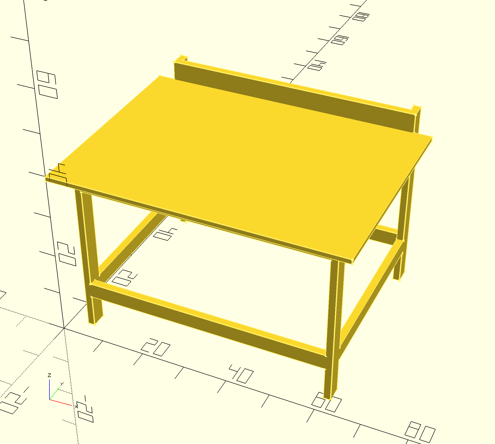

# workbench

Workbench made from 2x4s and Simpson Strong Ties

## Introduction

These plans (of a sort) are inspired by the design for a workbeanch from Simpson Strong Ties

Link to project page: https://www.strongtie.com/homeowners/projects

Link to direct PDF download: https://embed.widencdn.net/pdf/plus/ssttoolbox/zywgqd8wjo/DIY-CSHDTBL19.pdf

Modeled in OpenSCAD.

## Modifications

I modified the plan to make it much larger. It's custom for a big peice of MDF I had laying around. I skipped the bottom shelf for now. I made add one later, or just put some 2x4s across or something.

I also made the back posts taller and made the top back rail out of a 2x6 to make a bit of a backstop for the work surface.

_Note_: I modified it further to make better use of 96" (8 foot) boards. By bringing in the posts and rails 4" on the front, left, and right, now one board can provide both long rails and short posts.

## Shopping list

- 6 x 96" (8 foot) 2x4 lumber
- 1 x 96" (8 foot) 2x6 lumber (you could change this to 2x4 if you don't mind a slightly lower back stop)
- 1 x 96"x48" MDF (1" thick) (You can use thinner and modify the dimensions in the file; this is just what I had to start with)
- 8 x Simpson Strong Ties model Rigid Tie RTC2Z connectors
- lots of #8 1 1/4" screws (like 100 maybe?)

