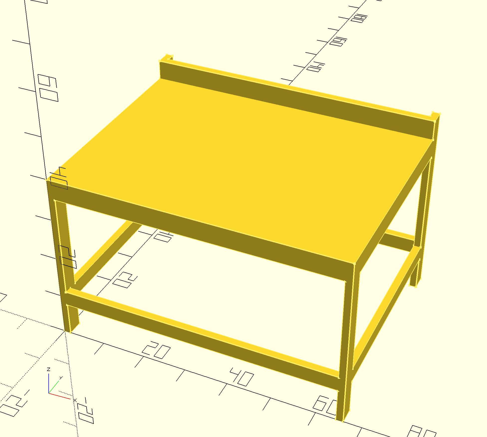

# workbench

Workbench made from 2x4s and Simpson Strong Ties

## Introduction

These plans (of a sort) are inspired by the design for a workbeanch from Simpson Strong Ties

Link to project page: https://www.strongtie.com/homeowners/projects

Link to direct PDF download: https://embed.widencdn.net/pdf/plus/ssttoolbox/zywgqd8wjo/DIY-CSHDTBL19.pdf

Modeled in OpenSCAD.

## Modifications

I modified the plan to make it much larger. It's custom for a big peice of MDF I had laying around. I skipped the bottom shelf for now. I made add one later, or just put some 2x4s across or something.

I also made the back posts taller and made the top back rail out of a 2x6 to make a bit of a backstop for the work surface.

